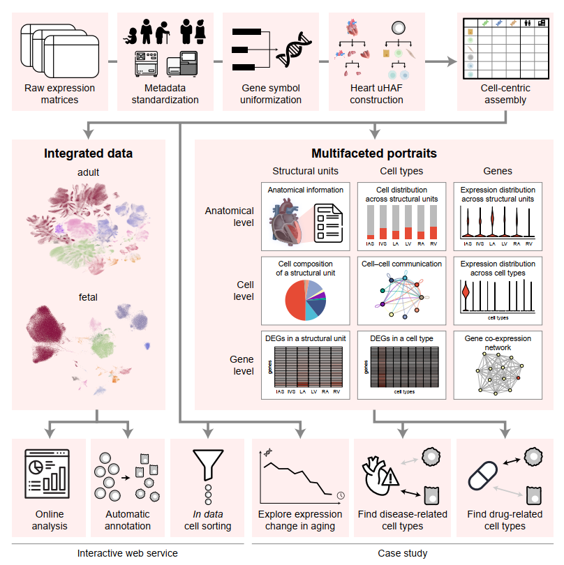

# uniHEART: An Ensemble Atlas of Cardiac Cells Provides Multifaceted Portraits of the Human Heart

## introduction
We collected scRNA-seq and snRNA-seq data of healthy human hearts from all available sources and built the first human ensemble heart cell atlas, uniHEART, using a unified information framework for cell-centric atlas assembly. uniHEART is available at https://heart.unifiedcellatlas.org/.

This repository contained the codes of:
* data processing
* integration benchmarking experiments
* data integration
* construction of multifacted portraits
* scripts of case studies
* online analysis tool 
* ECAUGT2 tool